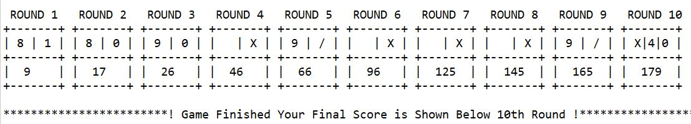

# Bowling-Game

This a bowling game simulated using Java and the scorecard is generated accordingly. 

Download the MyBowlingGame folder and then Run the game you need to use following command in terminal and follow the instructions that appears on terminal:

(Project Path)\bin>java bowling.main.MyBowlingGame 

Once the game is statrted by pressing enter you toss the bowl.

Rules of the Game

1.  Every game consists of 10 rounds 
2.  In every round, the player has two tosses
3.  In the first toss, the player can randomly bowl at most 10 pins
4.  In the second toss, the player can bowl randomly another (10 – number of bowled pins from the first toss) pins
5.  The score per round is calculated based on the number of bowled pins + additional bonuses if a strike or spare was achieved.
6.  A strike is accomplished when all 10 pins were bowled in the first toss already.
7.  A spare is accomplished when all 10 pins were bowled in two tosses.
8.  The bonus for a spare round is calculated based on the bowled pins of the next toss.
9.  The bonus for a strike round is calculated based on the bowled pins of the next two tosses.
10. In the very last round (i.e., round 10) a player may have an additional third toss, if he again achieved a strike or spare within   this round.

After finishing all 10 rounds you will see the final output as following:

ENJOY THE GAME !!!

